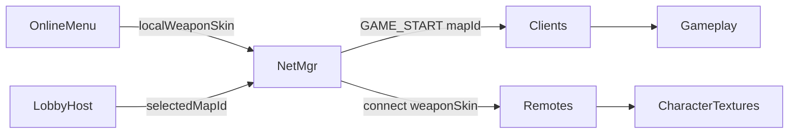

# Map Selection + Gun Skin UI Template Plan

## Direction (locked)

Reuse the **cinematic coastal glass** language from [`src/ui/`](src/ui/) and the Online **stage + card selector** pattern from [`character_preview`](src/ui/character_preview.cpp).

| Feature | Where | Who |
|---------|-------|-----|
| **Map select** | Lobby right column (above Ready/Start) | Host only; clients see selected map as read-only |
| **Gun skin** | Online menu (with character) | Every player before Host/Join |

Do not overload `currentWeaponIndex` (SMG/Shotgun/Pistol hotkeys). Gun skin is a **cosmetic pack** applied to all three weapon textures.

Until more map/weapon art exists: ship **Beach** as map 0 and **Default** gun skin 0 using current `weaponR1/2/3.png`. Extra cards can be marked locked/coming soon with muted chrome so the UI already feels like a full selector.

## Screen layouts

### Online menu — character + gun skin

```
┌─ glass shell ──────────────────────────────────────┐
│ LEFT                         RIGHT                  │
│ [Character stage]            Name / Host / Join     │
│ [Char1..4 cards]                                    │
│ [Gun stage / icon]                                  │
│ [Skin0..N cards]   ← same selector template         │
└────────────────────────────────────────────────────┘
```

Tabs or stacked sections: **FIGHTER** then **LOADOUT** under the left column so Host/Join stay on the right. Selected gun skin shows large weapon icon(s) on a small stage (not full character).

### Lobby — map select

```
┌─ LOBBY ────────────────────────────────────────────┐
│ Roster (left)              ROOM (right)            │
│ portraits + char +         MAP                     │
│ gun-skin badge             [Beach] [Locked…]       │
│                            thumbnail + name        │
│                            Ready / Start / Copy    │
└────────────────────────────────────────────────────┘
```

Host clicks map cards; clients see gold highlight on host’s choice only. Map name shown in room header (“MAP · BEACH”).

## Shared UI template (core of this work)

Add a reusable **select-grid widget** so map and gun skin don’t duplicate CharacterPreview layout code:

- [`src/ui/select_gallery.h/.cpp`](src/ui/select_gallery.h) — generic card row/grid:
  - `DrawGallery(area, items[], selectedId, mouse)` → clicked id
  - Each item: thumbnail `Texture2D` (or tinted placeholder), label, `locked` flag
  - Same gold frame pulse / hover as character cards
- [`src/ui/map_catalog.h`](src/ui/map_catalog.h) — `MapId`, display name, folder path, thumbnail path
- [`src/ui/weapon_skin_catalog.h`](src/ui/weapon_skin_catalog.h) — `WeaponSkinId`, display name, path prefix or tint recipe for `weaponR1/2/3`

Thin wrappers:

- `MapPreview` — large thumbnail stage + gallery via template
- `WeaponSkinPreview` — draws the three gun icons for selected skin + gallery

Theme stays in [`ui_theme.h`](src/ui/ui_theme.h) / [`ui_widgets`](src/ui/ui_widgets.cpp).

## Data + gameplay wiring



1. **Maps** — `MapId` + `MapPath(id)` helper; [`GameplayScreen`](src/screens/main_level.cpp) / [`MenuBackground`](src/screens/menu_background.cpp) load via helper instead of hardcoded `"assets/Maps/Beach/"`.
2. **Gun skins** — `NetworkManager::localWeaponSkin` + `PlayerInfo.weaponSkin`; [`Character`](src/entities/character.cpp) loads textures from skin catalog (skin 0 = today’s paths).
3. **Packets** — extend [`PacketGameStart`](src/network/packets.h) with `mapId`; add `weaponSkin` next to `charSkin` on connect/update (same pattern as existing skin sync). Host may broadcast `MAP_CHANGED` when changing map in lobby so clients update UI live.

## Motion / polish

- Card hover lerp + selected pulse (reuse character select feel)
- Map thumbnail soft ken-burns or static with gold border
- Locked cards: dim + lock label, no click
- Lobby: map change plays existing `choice.wav`

## Out of scope

- New map art packs / new weapon PNG sets (registry + locked slots only)
- Changing weapon balance or hotkey slots 1/2/3
- Offline map picker (offline keeps Beach / map 0 unless later shared)

## Key files

| Action | File |
|--------|------|
| Add | `src/ui/select_gallery.*`, `map_catalog.h`, `weapon_skin_catalog.h`, `map_preview.*`, `weapon_skin_preview.*` |
| Edit | [`online_menu.*`](src/screens/online_menu.cpp) — gun skin gallery |
| Edit | [`lobby_screen.*`](src/screens/lobby_screen.cpp) — host map gallery + roster badges |
| Edit | [`packets.h`](src/network/packets.h), [`network_manager.*`](src/network/network_manager.cpp) |
| Edit | [`character.cpp`](src/entities/character.cpp), [`main_level.cpp`](src/screens/main_level.cpp) — load by id |
| Build | include `src/ui/*.cpp` (already required) |

## Success criteria

- Online: player can see and pick a gun skin with the same quality as character select.
- Lobby: host can see and pick a map; clients see the choice; Start loads that map.
- Beach + Default skin fully playable; extra slots render as locked templates.
- Visual language matches main/online/lobby glass UI (Bruce Forever, gold accent, no flat debug panels).
