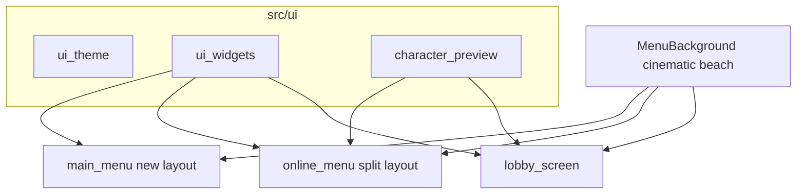

# Main Menu + Online UI — Layout, Backdrop, Character Select

## What changes from the previous plan

User feedback: current **layout is bad**, **main menu background is ugly**, and Online must let you **choose a character while seeing the characters** — not a “Char N” text button.

Locked decisions:

1. **Backdrop** — drop the chaotic live bot-fight blur as the default menu look. Replace with a **cinematic beach still** (map + silhouettes + slow camera drift + soft blur + vignette). Warm coastal tones — no purple dusk gradient.
2. **Layouts redesigned** — not chrome on the same centered stack. New compositions for Main, Online, Lobby.
3. **Character select** — show all **4 full-body characters** (animated idle when possible) with clear selection; clicks change `localSkinIndex` (1–4).

Network Host/Join/Ready/Start behavior stays the same.

## Visual direction

Cinematic coastal: warm sand/sky, dark glass UI, gold primary accent, Bruce Forever titles. Readable over a calm beach backdrop — not a busy fight feed.

## Architecture




## 1. Shared UI — `src/ui/`

- `[ui_theme.h](src/ui/ui_theme.h)` — colors, spacing, font sizes.
- `[ui_widgets.h/.cpp](src/ui/ui_widgets.cpp)` — glass panel, mode/action button, text field, status banner, back hint, hover lerp.
- `[character_preview.h/.cpp](src/ui/character_preview.cpp)` — load Char 1–4 from existing paths:
  - Body: `assets/.../Full body animated characters/Char N/with hands/`
  - Head fallback: `assets/Head_display/charN.png`
  - API: draw a **selectable row/grid of 4**, highlight selected, return hover/click index; optional idle anim tick.

## 2. Main menu background — rewrite `[menu_background.*](src/screens/menu_background.h)`

**Problem:** `LIVE_GAMEPLAY` (bots fighting + heavy blur) reads messy; existing `DUSK_PARALLAX` leans purple/pink and tiles the beach badly.

**Replace default with cinematic beach still:**

- Draw beach map + rocks/trees as a calm scene (no combat sim ticking for menus).
- Slow camera drift + very soft blur (steady ~0.35–0.5, not fight-cam chaos).
- Warm sky gradient (sand/amber, not purple) + vignette so UI text pops.
- Keep `LIVE_GAMEPLAY` code path optional/unused for now so we can revive later; menus always use the cinematic style.
- Reuse same backdrop instance pattern on Online + Lobby so all menus share one look.

## 3. Main menu layout — redesign `[main_menu.cpp](src/screens/main_menu.cpp)`

Stop: centered “MAIN MENU” + two gray boxes.

**New composition (1300×680):**

```
[ cinematic beach full-bleed ]
  left / center-left:
    brand title (large) + short tagline
  right column or lower-center:
    OFFLINE  — wide glass mode card
    ONLINE   — wide glass mode card
  bottom: subtle hint / version-safe empty
```

- Mode cards: icon/label + short line (“Solo vs bots” / “Host or join friends”), hover lift + gold accent.
- Entrance fade kept; music fade kept.
- Same navigation outcomes (`GameMode::OFFLINE` / `ONLINE`).

## 4. Online menu — layout + visible character select — `[online_menu.*](src/screens/online_menu.cpp)`

Stop: flat blue + “Char N” button.

**Split layout:**

```
[ cinematic beach ]
┌──────────────── glass shell ────────────────┐
│  LEFT (~55%)              RIGHT (~45%)       │
│  CHOOSE CHARACTER         YOUR SETUP         │
│  [Char1][Char2]           Name field         │
│  [Char3][Char4]           CREATE ROOM        │
│  selected = gold frame    JOIN ROOM          │
│  large idle preview       hints / ESC back   │
└─────────────────────────────────────────────┘
```

- All **four characters visible** at once (thumbnails or small idle sprites); selected one can also show larger preview.
- Click cycle replaced by **direct pick**; arrows optional.
- Join address mode replaces right panel content (field + connect); left character column stays so skin is always visible.
- Connecting: overlay spinner on the glass shell (not yellow debug text).
- Errors: bottom status banner.
- Still writes `NetworkManager::localUsername` / `localSkinIndex` before Host/Join.

## 5. Lobby layout — `[lobby_screen.*](src/screens/lobby_screen.cpp)`

```
[ cinematic beach ]
┌─ PLAYERS (left) ──────────┬─ ROOM (right) ─┐
│ portrait + name + ready   │ Host / Player   │
│ ...                       │ Ready button    │
│                           │ Start (host)    │
│                           │ Copy LAN row    │
└───────────────────────────┴─────────────────┘
```

- Each roster row shows **head/skin portrait** for that player’s `charSkin`, not text-only “Skin: 2”.
- Mouse + keep `R` / `SPACE` / `C` / `ESC`.

## 6. Motion budget

1. Screen/panel entrance fade + slight rise.
2. Mode/action button hover lerp.
3. Character select: selected frame pulse + idle anim on preview.
4. Connecting spinner.

## 7. Out of scope

- In-game HUD
- Matchmaking redesign
- Network protocol / skin ID range (still 1–4)
- Full intro rewrite

## Key files


| Action                 | File                                                                                                         |
| ---------------------- | ------------------------------------------------------------------------------------------------------------ |
| Add                    | `src/ui/ui_theme.h`, `ui_widgets.*`, `character_preview.*`                                                   |
| Rewrite backdrop       | `[src/screens/menu_background.h](src/screens/menu_background.h)` / `[.cpp](src/screens/menu_background.cpp)` |
| Redesign               | `[src/screens/main_menu.*](src/screens/main_menu.cpp)`                                                       |
| Redesign + char select | `[src/screens/online_menu.*](src/screens/online_menu.cpp)`                                                   |
| Redesign               | `[src/screens/lobby_screen.*](src/screens/lobby_screen.cpp)`                                                 |
| Build                  | compile list / Makefile for new `.cpp` files                                                                 |


## Success criteria

- Main menu backdrop looks calm and cinematic — not a messy fight blur.
- Layouts feel intentional (brand + modes; character gallery + setup; roster + room).
- Online: all 4 characters visible; selecting one is obvious and updates the skin used in lobby/game.
- No flat `{20,20,40}` online/lobby screens; Bruce Forever on titles/primary labels.
- Host / Join / Ready / Start / Copy still work.

