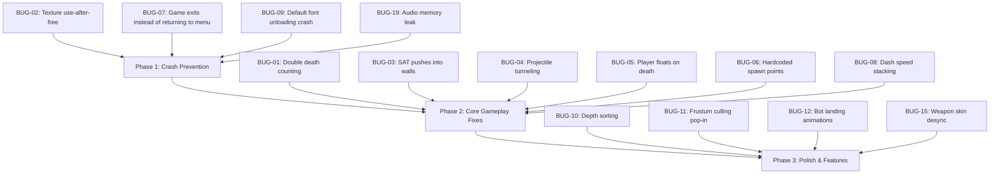

# 🎮 Rgamestudio — Full Game Audit Report

> **Scope:** All source files across entities, map loading, screens, utilities, and the main game loop.
> **Focus areas:** Maps, collisions, physics, state machines, memory, and game flow.

---

## Summary Dashboard

| Category | 🔴 Critical | 🟠 Major | 🟡 Minor | Total |
|---|---|---|---|---|
| Collision & Physics | 3 | 2 | 1 | **6** |
| Map & Rendering | 2 | 2 | 1 | **5** |
| Game Logic & State | 2 | 3 | 1 | **6** |
| Memory & Resources | 2 | 1 | 0 | **3** |
| Architecture & Flow | 0 | 2 | 2 | **4** |
| **Total** | **9** | **10** | **5** | **24** |

---

## 🔴 Critical Bugs

### BUG-01: Double Death Counting for Local Player
**Files:** [main_level.cpp](file:///c:/Users/rexje/Rgamestudio/src/screens/main_level.cpp) ~L543-544

When an offline monster kills the player in melee, the death counter is incremented **twice**:

```cpp
nearestTarget->AddDeath();                    // +1 death (nearestTarget IS player)
if (nearestTarget == player) player->AddDeath(); // +1 death AGAIN!
```

> [!CAUTION]
> The player's death count is **doubled** every time a monster kills them. Scoreboards, K/D ratios, and any respawn-penalty logic are all corrupted. Remove the redundant `if` block.

---

### BUG-02: Texture Cache Use-After-Free (Crash Risk)
**File:** [character.cpp](file:///c:/Users/rexje/Rgamestudio/src/entities/character.cpp) ~L159-161

`SetWeaponSkin()` calls `UnloadTexture()` on textures obtained from the shared `TextureManager` cache. This destroys the GPU texture ID globally — any other character or UI element still referencing that cached texture will render as a black/white rectangle or cause a GPU crash.

```cpp
for (auto& texture : weaponTextures) {
    if (texture.id != 0) {
        UnloadTexture(texture); // ❌ Destroys shared cached texture!
    }
}
```

> [!CAUTION]
> **Fix:** Do NOT unload cached textures. Simply clear the local vector and let `TextureManager` own the lifecycle. Only unload textures you directly loaded via `LoadTexture()`.

---

### BUG-03: SAT Collision Pushes Characters INTO Walls
**File:** [main_level.cpp](file:///c:/Users/rexje/Rgamestudio/src/screens/main_level.cpp) ~L356-365

The `SATPushOut` function determines push-out direction by projecting away from the polygon's **geometric centroid**. For L-shaped, thin, or concave polygons (which Tiled supports), the centroid can be mispositioned or even outside the geometry.

```
Character ──push──▶ ████████
                     ██      ← Centroid is here (inside concavity)
                     ████████
```

> [!CAUTION]
> For irregular collision shapes, the character gets pushed **deeper into the wall** instead of out. Use the actual colliding edge's outward normal (from vertex winding order) instead of centroid-based direction.

---

### BUG-04: Projectile Tunneling — Bullets Pass Through Characters
**Files:** [projectile.cpp](file:///c:/Users/rexje/Rgamestudio/src/entities/projectile.cpp) ~L16-20, [main_level.cpp](file:///c:/Users/rexje/Rgamestudio/src/screens/main_level.cpp) ~L456

Projectiles update position discretely each frame. The SMG has `bulletSpeed = 1000.0f`, meaning bullets travel ~16.6 units per frame at 60 FPS. Character collision boxes are only ~8 units wide (`FOOT_HALF_W = 4.0f`).

```
Frame N:  bullet ●────────────────────● Frame N+1
                      [character]
                   ← only 8 units wide →
```

> [!CAUTION]
> Fast bullets skip entirely over thin characters without registering a hit. **Fix:** Implement swept/raycast collision detection between the bullet's previous and current position each frame.

---

### BUG-05: Player Death Freezes Character Mid-Air
**File:** [player.cpp](file:///c:/Users/rexje/Rgamestudio/src/entities/player.cpp) ~L21-24

When the player dies, `Update()` immediately returns after updating animations, **skipping `UpdatePhysics()`**. If the player dies mid-jump, gravity stops processing and the corpse floats indefinitely.

```cpp
void Player::Update(float deltaTime) {
    if (IsDead()) {
        animations[currentState]->Update(deltaTime);
        return; // ❌ UpdatePhysics() never reached — body floats in mid-air
    }
```

> [!IMPORTANT]
> `BotEnemy::Update()` handles this correctly by still calling physics after death. Apply the same pattern to `Player`.

---

### BUG-06: Hardcoded Spawn Points Ignore Map Data
**Files:** [main_level.cpp](file:///c:/Users/rexje/Rgamestudio/src/screens/main_level.cpp) ~L1459-1470, ~L702

Despite building a `MapSceneRegistry` system for dynamic, per-map spawn points, `GetFarSpawnPoint()` still uses a **hardcoded array of 9 coordinates** from the original Forest map layout.

```
Forest2 map loaded → spawn points still reference Forest1 coordinates
                   → entities spawn out-of-bounds
                   → ClampCharacterToWorld() pushes them all into corners
```

> [!CAUTION]
> All entities bunch up in map corners on non-Forest maps. **Fix:** Read spawn points from `currentMapData->scene.spawnPoints` instead of the hardcoded array.

---

### BUG-07: Exiting Gameplay Terminates the Entire Application
**File:** [main.cpp](file:///c:/Users/rexje/Rgamestudio/src/main.cpp) ~L88-154

The screen state machine has no `isGameplayActive` flag. When `GameplayScreen::Update()` returns `false` (game over / quit), execution falls into the final `else` block which deletes the screen and **breaks the game loop**, exiting the application instead of returning to a menu.

> [!CAUTION]
> Players cannot return to the main menu after a match ends — the game just closes. Add a `isGameplayActive` state flag and transition back to the appropriate menu on gameplay exit.

---

### BUG-08: Double Movement During Dash (Speed Exploit)
**Files:** [character.cpp](file:///c:/Users/rexje/Rgamestudio/src/entities/character.cpp) ~L624-630, [player.cpp](file:///c:/Users/rexje/Rgamestudio/src/entities/player.cpp) ~L72-73

When dashing, `UpdateSkills()` applies dash velocity to position. But subclasses (`Player`, `BotEnemy`) **also** apply their own walk velocity in the same frame, stacking movement:

```cpp
// character.cpp: Dash applies velocity
position.x += dashDirection.x * dashSpeed * deltaTime;  // ← dash movement

// player.cpp: Walk ALSO applies velocity in the same frame!
position.x += velocity.x * deltaTime;  // ← stacked on top of dash!
```

> [!WARNING]
> Characters move at `dashSpeed + walkSpeed` instead of just `dashSpeed` during dashes. **Fix:** Skip walk velocity application when `isDashing` is true.

---

### BUG-09: Unsafe Default Font Unloading (Crash Risk)
**File:** [intro_screen.cpp](file:///c:/Users/rexje/Rgamestudio/src/screens/intro_screen.cpp) ~L6, L28, L37-40

`FirstScreen` loads fonts via `LoadFontEx`. If the TTF file is missing, Raylib returns the **default engine font**. The destructor blindly calls `UnloadFont()`, which destroys the default font for the entire application.

> [!WARNING]
> Guard with `if (font.texture.id != GetFontDefault().texture.id)` before unloading, as `MainMenuScreen` already does correctly.

---

## 🟠 Major Bugs

### BUG-10: Column Depth Sorting Breaks Multi-Object Columns
**File:** [main_level.cpp](file:///c:/Users/rexje/Rgamestudio/src/screens/main_level.cpp) ~L854-862

Depth sorting aggregates by **vertical column** (`tx`), forcing all tiles in a column to use the bottom-most tile's depth. If two trees exist in the same column at different Y positions, characters walking between them render with incorrect depth.

```
Tree A (y=10)  ← forced to depth y=30 ❌
Character (y=20) ← renders BEHIND tree A incorrectly
Tree B (y=30)  ← correct depth
```

**Fix:** Track depth per individual tile object, not per column.

---

### BUG-11: Tall Tiles Popping Out of View (Frustum Culling)
**File:** [main_level.cpp](file:///c:/Users/rexje/Rgamestudio/src/screens/main_level.cpp) ~L868

Culling checks if `rowWorldY > viewport.y + viewport.height`, but tall Tiled objects draw **upward** from their base. A tree whose base is just below the viewport bottom gets culled, causing its visible canopy to pop out of existence.

**Fix:** Add `tileHeight` margin to the culling threshold: `rowWorldY - maxTileHeight > viewport.y + viewport.height`.

---

### BUG-12: Bot AI Skips Landing Animations
**File:** [bot_enemy.cpp](file:///c:/Users/rexje/Rgamestudio/src/entities/bot_enemy.cpp) ~L242-254, L284-292

`UpdateAI()` unconditionally sets state to `WALK` or `IDLE` based on movement at the top of the function. The landing check at the bottom (`if currentState == JUMP_START || FALL`) always evaluates to `false` because the state was already overwritten.

**Fix:** Move the landing animation check **before** the walk/idle assignment, or use a priority system.

---

### BUG-13: `GetFeetCircle()` Broken When Animation Missing
**File:** [character.cpp](file:///c:/Users/rexje/Rgamestudio/src/entities/character.cpp) ~L296-306

If the current animation has no frames, `sh` defaults to `0.0f`. The feet circle position becomes `draw_y - radius`, placing it near the character's center/waist instead of at the feet. This causes a major collision mismatch vs `GetCollisionBounds()`.

---

### BUG-14: Menu Background Bots Have No Collision
**File:** [menu_background.cpp](file:///c:/Users/rexje/Rgamestudio/src/screens/menu_background.cpp) ~L296-299

The `resolveWorld` lambda is entirely empty:
```cpp
auto resolveWorld = [&](Character* c) { if (!c) return; };
```
Bots in the menu background clip through all solid map geometry (rocks, tree trunks, walls).

---

### BUG-15: Weapon Skin Loadout Desync
**Files:** [offline_menu.cpp](file:///c:/Users/rexje/Rgamestudio/src/screens/offline_menu.cpp) ~L210-214, [online_menu.cpp](file:///c:/Users/rexje/Rgamestudio/src/screens/online_menu.cpp) ~L352-358

The game saves weapon skin selection to a **single integer** (`localWeaponSkin`), but the UI has multiple weapon tabs. Only the **currently active tab's** skin is saved when START is pressed — all other weapon skins are lost.

---

### BUG-16: `minDist` Initialization Too Small for Squared Distance
**File:** [menu_background.cpp](file:///c:/Users/rexje/Rgamestudio/src/screens/menu_background.cpp) ~L182-192

`GetNearestTargetForBot` initializes `minDist = 999999.0f` and compares against **squared** distances. The world is 3900×2040, so max squared distance is ~19.3 million. Bots farther than ~1000 units apart will ignore each other.

**Fix:** Initialize to `FLT_MAX`.

---

### BUG-17: Muzzle Flash Timer Updated in `Draw()`
**File:** [character.cpp](file:///c:/Users/rexje/Rgamestudio/src/entities/character.cpp) ~L432-433

The `muzzleFlashTimer` is decremented inside `Draw()` using `GetFrameTime()`. If the character is drawn multiple times per frame (minimap, shadow pass) or if rendering is paused, the timer decays at unpredictable rates.

**Fix:** Move to `Update()` where all other timers are managed.

---

### BUG-18: Network Event Queue Starvation
**File:** [lobby_screen.cpp](file:///c:/Users/rexje/Rgamestudio/src/screens/lobby_screen.cpp) ~L140-156

`LobbyScreen::Update` drains all events from the network queue. Any packets not explicitly handled by the lobby (chat, ping, background sync) are silently discarded, starving other systems.

---

### BUG-19: Audio Memory Leak
**File:** [main_menu.cpp](file:///c:/Users/rexje/Rgamestudio/src/screens/main_menu.cpp) ~L34, L37

`choiceSound` is loaded in the constructor but never unloaded in the destructor. Audio buffer memory leaks every time the screen is recreated.

---

## 🟡 Minor Issues

### BUG-20: Tiled Polygon Vertex Parsing Assumption
**File:** [main_level.cpp](file:///c:/Users/rexje/Rgamestudio/src/screens/main_level.cpp) ~L265

`GetWorldPolygonVertices()` skips `points[0]` and stops at `pointsLength - 1`, assuming raytmx stores a centroid in index 0 and duplicates the first vertex at the end. If raytmx is updated, collision boundaries will silently lose a vertex.

### BUG-21: Dead Physics Code
**File:** [main_level.cpp](file:///c:/Users/rexje/Rgamestudio/src/screens/main_level.cpp) ~L253

`PolygonClosestEdgePushOut` is forward-declared with documentation but never defined or called. Dead code clutters the collision system.

### BUG-22: Online Respawn Ignores Map Geometry
**File:** [main_level.cpp](file:///c:/Users/rexje/Rgamestudio/src/screens/main_level.cpp) ~L702

Pressing `R` in online mode hardcodes respawn to `worldWidth / 2.0f ± 200`, which may place the player directly inside solid map geometry.

### BUG-23: O(B² × P) Projectile Collision in Menu
**File:** [menu_background.cpp](file:///c:/Users/rexje/Rgamestudio/src/screens/menu_background.cpp) ~L260-275

Triple-nested loop checks every projectile of every bot against every other bot. Acceptable for small bot counts but scales poorly.

### BUG-24: Inconsistent `deltaTime` Usage
**File:** [character.cpp](file:///c:/Users/rexje/Rgamestudio/src/entities/character.cpp) ~L432

`Draw()` uses `GetFrameTime()` while `Update()` receives `deltaTime` as a parameter. These can diverge if the engine buffers or smooths frame times.

---

## 📋 Feature Recommendations

### 🗺️ Map System Improvements

| # | Feature | Priority | Description |
|---|---------|----------|-------------|
| F-01 | **Dynamic Spawn Point System** | 🔴 High | Replace hardcoded spawn arrays with `currentMapData->scene.spawnPoints`. Add spawn point validation (not inside walls, minimum distance apart). |
| F-02 | **Map Boundary Visualization (Debug)** | 🟡 Low | Add a debug overlay (`F3` key) that draws collision polygons, spawn points, and culling boundaries on top of the map for development. |
| F-03 | **Map Transition Zones** | 🟠 Medium | Add "zone" objects in Tiled that trigger map transitions, enabling multi-area levels or seamless world loading. |
| F-04 | **Tile-Based Pathfinding Grid** | 🟠 Medium | Generate a navmesh or pathfinding grid from collision polygons so bots can navigate around obstacles intelligently instead of walking into walls. |

### 💥 Collision System Improvements

| # | Feature | Priority | Description |
|---|---------|----------|-------------|
| F-05 | **Swept/Raycast Collision for Projectiles** | 🔴 High | Replace point-in-AABB checks with ray-segment intersection between the bullet's previous and current position to prevent tunneling. |
| F-06 | **Edge-Normal Based Push-Out** | 🔴 High | Replace centroid-based MTV direction with actual edge normal calculation using vertex winding order. This fixes the "pushed into walls" bug for all irregular polygons. |
| F-07 | **Spatial Partitioning (Grid/Quadtree)** | 🟠 Medium | Implement a spatial hash grid for entity-to-entity and projectile-to-entity collision checks. Reduces O(n²) to near O(n) for large entity counts. |
| F-08 | **One-Way Platforms** | 🟡 Low | Support platform tiles that allow upward passage but block downward falling, enabling platforming level design. |

### 🎮 Gameplay Features

| # | Feature | Priority | Description |
|---|---------|----------|-------------|
| F-09 | **Ragdoll/Physics Death** | 🟠 Medium | Instead of freezing mid-air on death, apply a death impulse and let gravity pull the body down naturally (as `BotEnemy` already does). |
| F-10 | **Dash Cancellation System** | 🟠 Medium | Add proper dash state management: disable walk input during dash, add dash cooldown UI feedback, and allow dash cancellation via jump. |
| F-11 | **Per-Weapon Skin Slots** | 🟠 Medium | Replace the single `localWeaponSkin` integer with a `std::map<WeaponType, int>` to properly save/load skins for each weapon independently. |
| F-12 | **Kill Feed / Combat Log** | 🟡 Low | Display a scrolling feed of kills, deaths, and assists in the corner of the screen during matches. |
| F-13 | **Damage Numbers** | 🟡 Low | Show floating damage numbers above hit characters that fade out and drift upward. |

### 🏗️ Architecture Improvements

| # | Feature | Priority | Description |
|---|---------|----------|-------------|
| F-14 | **Screen State Machine Refactor** | 🔴 High | Add proper state flags for all screen types, implement `onEnter()`/`onExit()` lifecycle hooks, and ensure gameplay exit returns to menu instead of closing the app. |
| F-15 | **Centralized Resource Manager** | 🟠 Medium | Extend `TextureManager` with reference counting so textures are only unloaded when no entity references them. Prevents the use-after-free crash. |
| F-16 | **Event Bus / Message Queue** | 🟠 Medium | Replace direct network queue draining with a pub/sub event system so multiple screen systems can independently consume relevant network events. |
| F-17 | **Fixed Timestep Physics** | 🟡 Low | Decouple physics updates from rendering with a fixed timestep accumulator. This prevents collision tunneling at low FPS and ensures deterministic behavior for replays/netcode. |

---

## 🔧 Recommended Fix Priority Order

> [!IMPORTANT]
> The following order minimizes cascading breakage and addresses the highest-impact bugs first.



### Phase 1 — Crash Prevention (Do First)
1. **BUG-02**: Remove `UnloadTexture()` calls on cached textures in `SetWeaponSkin()`
2. **BUG-07**: Add `isGameplayActive` flag and proper menu-return transition
3. **BUG-09**: Add font ID guard before `UnloadFont()` in `FirstScreen`
4. **BUG-19**: Add `UnloadSound(choiceSound)` to `MainMenuScreen` destructor

### Phase 2 — Core Gameplay (Do Second)
5. **BUG-01**: Remove duplicate `player->AddDeath()` call
6. **BUG-05**: Call `UpdatePhysics()` for dead players (match `BotEnemy` pattern)
7. **BUG-08**: Skip walk velocity when `isDashing == true`
8. **BUG-06**: Use `currentMapData->scene.spawnPoints` in `GetFarSpawnPoint()`
9. **BUG-03**: Implement edge-normal push-out for SAT collision
10. **BUG-04**: Implement swept ray collision for projectiles

### Phase 3 — Polish (Do Third)
11. **BUG-10/11**: Fix depth sorting and frustum culling for tall tiles
12. **BUG-12**: Reorder bot AI state assignments for landing animation
13. **BUG-15**: Implement per-weapon skin storage
14. **BUG-17**: Move `muzzleFlashTimer` to `Update()`
15. **BUG-16/18**: Fix `minDist` init and network event consumption
